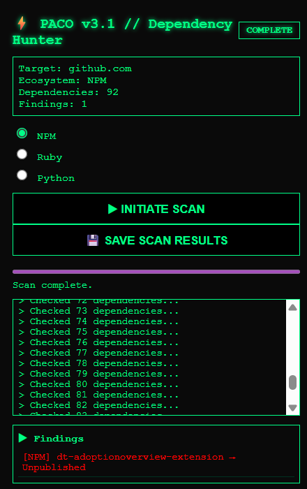

<p align="center">
  
</p>

<h1 align="center">⚡ PACO v3.1 – Dependency Hunter</h1>

<p align="center">
🛡️ Advanced Chrome Extension to detect unpublished, removed, or suspicious dependencies across GitHub repositories.
</p>

<p align="center">
Lightweight • Fast • Security-Focused • Zero Tracking
</p>

<p align="center">
  <a href="https://www.producthunt.com/posts/paco-package-confuser?embed=true&utm_source=badge-featured&utm_medium=badge&utm_souce=badge-paco&#0045;package&#0045;confuser" target="_blank"></a>
</p>

---

## 📽️ Live Demo

<p align="center">
  
</p>

<p align="center">
  
</p>


---

## 👨‍🔬 Tested By

**Sidhanta Palei (@r00tSid)**  
Security Researcher | Bug Bounty Hunter  

---

# ⚠️ What is Dependency Confusion?

Dependency Confusion (Substitution Attack) is a supply-chain vulnerability where an attacker publishes a malicious package with the same name as an internal/private dependency.

If the build system prefers public registries, it may install the malicious package.

This can result in:

- Remote Code Execution
- Data Exfiltration
- CI/CD Compromise
- Supply-Chain Attacks

PACO helps identify such risks early.

---

# 🚀 What is PACO?

**PACO (Package Confuser)** is a Chrome Extension designed to help developers and security researchers identify:

- 🔴 Unpublished packages  
- ❌ Non-existent dependencies  
- ⚠️ Potential dependency confusion risks  
- 📦 Broken or removed packages  

It scans public GitHub repositories and validates dependencies directly against official package registries.

---


# 🆕 What’s New in v3.1

PACO has evolved significantly from its initial release.

## 🔥 Smart Ecosystem Auto-Detection

PACO now automatically detects ecosystem based on:

- `Gemfile` → Ruby  
- `package.json` → NPM  
- `requirements.txt` → Python  

Works on:

- Repository pages  
- Blob/file pages  
- GitHub search result pages  

Detection priority:
1. URL-based detection  
2. Repository file fallback  

---

### 📦 JSON Export Support
One-click **SAVE SCAN RESULTS** button downloads a structured JSON report containing:

- Target URL
- Ecosystem
- Total dependencies scanned
- Total findings
- Timestamp
- Detailed findings list

---

### 🧠 Intelligent Deduplication
- Prevents duplicate dependency scans
- Prevents duplicate findings
- Optimized request queue for performance

---

### 🔎 Improved Search Page Handling
Fully supports scanning directly from:


Ecosystem detection is now context-aware and URL-driven.

---

# 🛠 Installation

1. Open **Google Chrome**
2. Navigate to:
3. Enable **Developer Mode**
4. Click **Load Unpacked**
5. Select the PACO project folder
6. Done ✅

---

# 🎯 How to Use

1. Visit:
- A GitHub repository
- A dependency file (Gemfile / package.json / requirements.txt)
- A GitHub search results page
2. Click the **PACO extension icon**
3. Click **INITIATE SCAN**
4. PACO will:
- Detect ecosystem automatically
- Extract dependencies
- Query official registries
- Flag high-risk packages
5. Click **SAVE SCAN RESULTS** to download JSON report

---

# 🔍 Supported Ecosystems

| Ecosystem | Files Scanned | Registry |
|------------|--------------|----------|
| **Node.js** | `package.json` | registry.npmjs.org |
| **Ruby** | `Gemfile` | rubygems.org |
| **Python** | `requirements.txt` | pypi.org |

> More ecosystems coming soon (Go Modules, Cargo, NuGet, Maven).

---

# 🧠 How PACO Works

1. **Content Script**
- Detects repository context
- Extracts dependency files

2. **Dependency Extraction**
- JSON parsing (NPM)
- Regex-based gem parsing (Ruby)
- Line-based parsing (Python)

3. **Registry Validation**
- Queries official registries
- Detects:
  - ✅ Published
  - ❌ Not Found
  - 🔴 Unpublished

4. **Smart Filtering**
- Deduplicates dependencies
- Handles concurrency efficiently
- Provides clean output

---

# 📊 Example JSON Export

```json
{
"timestamp": "2026-02-12T18:32:11Z",
"target": "https://github.com/org/repo",
"ecosystem": "RUBY",
"totalDependencies": 14,
"totalFindings": 1,
"findings": [
 {
   "name": "example-package",
   "type": "ruby",
   "status": "Unpublished"
 }
]
}
```
---

## 🛠 Tech Stack

| Layer             | Tech Used                                |
| ----------------- | ---------------------------------------- |
| **Platform**      | Chrome Extension (Manifest V3)           |
| **Frontend**      | HTML, CSS, Vanilla JavaScript            |
| **Backend Logic** | Fetch API, async/await, RegEx            |
| **Concurrency**   | Custom batch queue with smart throttling |
| **Messaging**     | Chrome runtime message passing           |

---

## 🗂 Project Structure

```
paco/
├── background.js      # Handles fetch requests and queues
├── content.js         # Scans GitHub pages for package links
├── manifest.json      # Chrome extension config (Manifest V3)
├── popup.html         # Extension popup UI
├── popup.js           # Popup logic and messaging
├── style.css          # UI styling
├── icons/             # Icon assets (128x128, etc.)
```

---


## 👨‍💻 Authors

* **Anurag Kumar** – [@anurag6240](https://github.com/anurag6240)
* **Sidhanta Palei** – [@r00tSid](https://github.com/r00tSid)

---

## 📘 Attribution

* GitHub logo used under fair use ([GitHub Brand Guidelines](https://github.com/logos)).
* This extension is **not affiliated with or endorsed by GitHub**.

---
